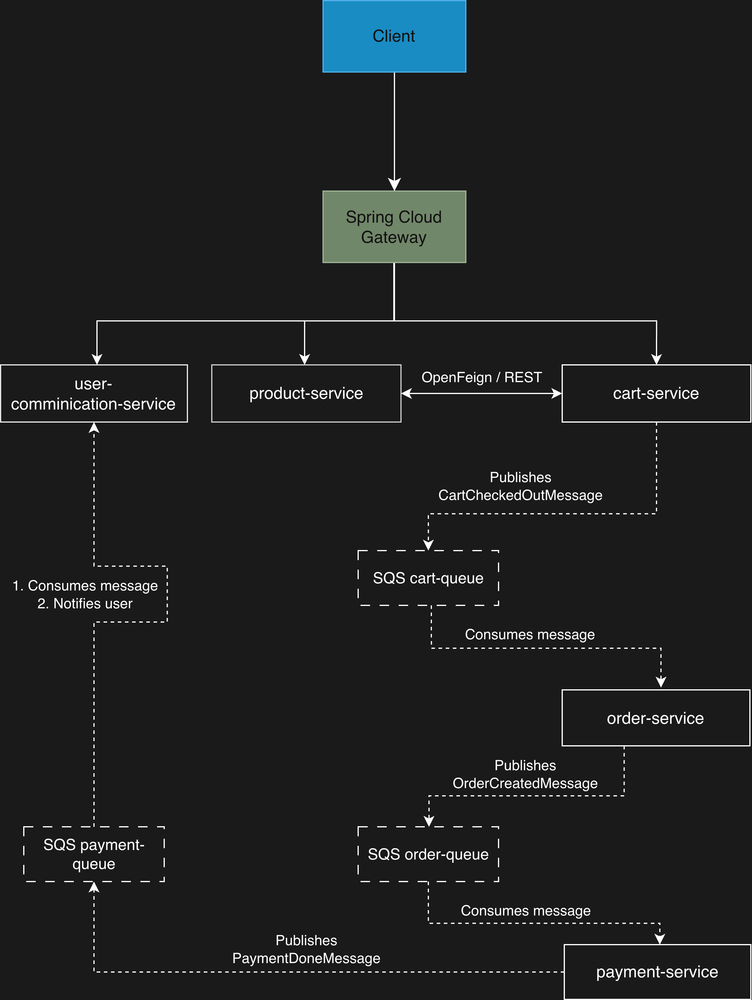

# Cloud-native E-Commerce Microservices System

A cloud-native e-commerce backend built with Spring Boot, Docker, and AWS, demonstrating microservice architecture, asynchronous communication with Amazon SQS, secure JWT authentication, and CI/CD with GitHub Actions.
This project aims to simulate a realistic backend system for a scalable online shop — complete with user management, product catalog, shopping cart, ordering, and notification subsystems.

# Table of Contents
<!-- TOC -->
* [Tech Stack](#tech-stack)
    * [Backend](#backend)
    * [Messaging](#messaging)
    * [Infrastructure](#infrastructure)
* [Architecture Overview](#architecture-overview)
* [Services](#services)
  * [user-communication-service](#user-communication-service)
  * [product-service](#product-service)
  * [cart-service](#cart-service)
  * [order-service](#order-service)
  * [payment-service](#payment-service)
<!-- TOC -->
## Tech Stack
### Backend
- Java 21
- Spring Boot 3
- Spring Security
- Spring Data JPA
- Spring Cloud Gateway
- PostgreSQL

### Messaging
- AWS SQS

### Infrastructure
- Docker & Docker Compose
- AWS Elastic Compute Cloud (EC2)
- AWS Elastic Container Registry (ECR)
- GitHub Actions CI/CD
- IAM Roles
- VPC

## Architecture Overview
The system follows a microservices architecture, where each service is responsible for a  single business  capability. \
Services communicate asynchronously via AWS SQS and synchronously via OpenFeign REST clients. All incoming requests from the frontend/Postman go into Gateway, which routes traffic to the correct service.

<p align="center">
  
</p>

## Services
### user-communication-service
Handles:
- User Registration
- Login
- JWT issuing
- Password hashing
- User Notification 

Creates a user in the database. Consumes event
```PaymentDoneMessage``` and notifies a customer about successful order

### product-service
Handles:
- Product CRUD
- Price and stock querying

### cart-service
Handles:
- Adding & Removing items
- Fetching product details via OpenFeign → Product Service
- Updating quantities
- Checkout

Publishes event 
```CartCheckedOutMessage```

### order-service
Handles:
- Receiving checkout events
- Creating orders
- Orchestrating order workflow

Consumes event
```CartCheckedOutMessage```\
Publishes event
```OrderCreatedMessage```

### payment-service
Mocks payment process

Consumes event
```OrderCreatedMessage```\
Publishes event
```PaymentDoneMessage```

